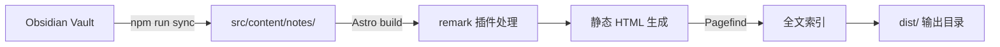

# Astro 笔记网站 — 需求文档

> 版本: v1.0
> 日期: 2026-06-02
> 状态: 已审批

---

## 1. 项目概述

### 1.1 目标

在 `/Users/sy/hermes/codes/Astro笔记网站开发/` 目录下，使用 Astro 框架搭建一个**完全兼容 Obsidian** 的静态笔记网站，支持个人笔记管理与公开分享。

### 1.2 核心原则

- **Obsidian 优先**: 笔记在 Obsidian 中编写编辑，网站仅作发布展示
- **镜像结构**: 网站目录与 Obsidian Vault 保持一致的目录层级
- **GitHub 风格**: 界面视觉模仿 GitHub UI 风格
- **静态输出**: 构建为纯静态 HTML，可部署到任何静态托管服务

---

## 2. 技术栈

| 层次 | 选型 | 说明 |
|------|------|------|
| 框架 | Astro 5.x | SSG 模式 |
| Markdown 处理 | remark + rehype 插件链 | 自建 Obsidian 兼容插件 |
| 图谱可视化 | vis-network | 交互式关系图 |
| 搜索 | Pagefind | 构建时全文索引 |
| 数学公式 | KaTeX | 轻量 LaTeX 渲染 |
| Mermaid 图表 | mermaid.js | 流程图/时序图等 |
| 样式 | CSS Custom Properties | 主题系统驱动 |
| 图标 | Octicons/Same-style | GitHub 风格图标 |
| 包管理 | npm | |

---

## 3. 功能需求

### 3.1 Obsidian 兼容性 (P0 — 必须)

| 特性 | 处理方式 | 优先级 |
|------|----------|--------|
| **Wikilinks** `[[笔记名]]` | remark 插件解析为内部链接，支持别名 `[[笔记名\|显示文本]]` | P0 |
| **Backlinks** | 构建时反向扫描所有 Wikilinks，在每篇笔记底部展示"被引用"列表 | P0 |
| **Tags** `#tag` | 从 frontmatter 和正文提取标签，生成标签索引页 | P0 |
| **YAML Frontmatter** | 解析为页面元数据（标题、日期、标签等） | P0 |
| **Properties** (Obsidian 1.4+) | 增强 frontmatter 展示，支持属性键值对显示 | P0 |
| **Callouts** `> [!note]` | remark 插件转换为带样式的 `<div class="callout">`，支持嵌套 | P0 |
| **Embed** `![[文件]]` | 构建时内联解析嵌入的笔记内容或图片资源 | P0 |
| **Highlight** `==高亮==` | 转换为 `<mark>` 标签 | P0 |
| **数学公式** `$$...$$` | KaTeX 渲染 | P0 |
| **Mermaid 图表** ` ```mermaid ` | 客户端动态渲染 | P1 |
| **Canvas / Excalidraw** | 提供下载链接，或嵌入静态导出图片 | P2 |

### 3.2 页面与路由 (P0)

| 路由 | 功能 |
|------|------|
| `/` | 首页 — 最新笔记列表、快捷入口、统计概览 |
| `/notes/[...path]` | 笔记详情 — 镜像 Vault 目录结构，支持任意层级嵌套 |
| `/tags/` | 标签总览 — 所有标签聚合展示（类似 GitHub Topics） |
| `/tags/[tag]` | 标签筛选 — 按标签列出笔记 |
| `/search` | 全文搜索 — Pagefind UI 集成 |
| `/graph` | 关系图谱 — 全屏交互式节点图 |
| `404` | 自定义 404 页面 |

### 3.3 笔记详情页功能 (P0)

- [x] Markdown 正文渲染（含所有 Obsidian 扩展语法）
- [x] 页面元数据显示（创建日期、修改日期、标签）
- [x] 目录树侧栏（高亮当前笔记位置）
- [x] 面包屑导航
- [x] 反向链接（Backlinks）列表
- [x] 上一篇 / 下一篇 导航
- [x] 页面内锚点目录（Table of Contents）

### 3.4 标签系统 (P0)

- [x] 从 YAML frontmatter 提取 `tags` 字段
- [x] 从正文提取 `#tag` 格式标签
- [x] 标签聚合页（标签云 / 列表）
- [x] 按标签筛选笔记
- [x] 标签徽章样式（GitHub Label 风格）

### 3.5 搜索 (P0)

- [x] 全文搜索覆盖所有笔记内容
- [x] 搜索结果按相关性排序
- [x] 搜索关键词高亮
- [x] 移动端友好搜索入口

### 3.6 图谱 (P1)

- [x] 节点 = 笔记（节点大小反映被引用数量）
- [x] 边 = 双向链接关系
- [x] 点击节点跳转到对应笔记
- [x] 拖拽和缩放交互
- [x] 搜索高亮特定节点

---

## 4. 非功能需求

### 4.1 设计风格

- **GitHub UI 视觉风格**
  - 字体: `-apple-system, BlinkMacSystemFont, 'Segoe UI', 'Noto Sans', Helvetica, Arial, sans-serif`
  - 等宽字体: `SFMono-Regular, Consolas, 'Liberation Mono', Menlo, monospace`
  - 颜色方案: 参考 GitHub 亮色/暗色配色
  - UI 组件风格模仿 GitHub（导航栏、文件列表、代码块、标签等）

### 4.2 主题系统

| 特性 | 说明 |
|------|------|
| 亮色/暗色切换 | 一键切换，遵循 `prefers-color-scheme` 自动选择 |
| 持久化 | 用户选择保存到 localStorage |
| CSS 变量驱动 | 所有颜色/间距/字体通过 CSS Custom Properties 定义 |
| 可扩展 | 用户可通过覆盖 CSS 变量创建自定义主题 |

### 4.3 响应式设计

| 断点 | 布局 |
|------|------|
| ≥1024px (桌面) | 三栏布局: 侧栏 + 正文 + 右侧目录 |
| 768-1023px (平板) | 正文占主导，侧栏可滑出 |
| <768px (手机) | 单栏布局，侧栏通过汉堡菜单打开 |

### 4.4 性能目标

- Lighthouse 性能评分 ≥ 90
- 首屏加载 ≤ 2s (3G 网络)
- 所有页面纯静态 HTML，无需 JavaScript 运行时即可阅读内容
- 图片懒加载

### 4.5 SEO

- 每个页面自动生成 `<title>` 和 `<meta description>`
- Open Graph / Twitter Card 元标签
- 语义化 HTML 结构
- 自动 Sitemap 生成

---

## 5. 内容管理

### 5.1 笔记同步

```
源: /path/to/external/Obsidian/Vault/
目标: astro-project/src/content/notes/

同步方式: npm run sync (shell 脚本)
  - 支持硬链接模式 (即时反映修改)
  - 支持复制模式 (完全隔离)
  - 自动排除: .obsidian/, .trash/, *.canvas, *.excalidraw
```

### 5.2 文件处理规则

| 文件类型 | 处理方式 |
|----------|----------|
| `*.md` | 解析为笔记页面 |
| `*.png`, `*.jpg`, `*.webp` | 复制到 `public/` 或使用 Astro 的 assets 处理 |
| `*.canvas` | 页面中嵌入下载链接或静态截图 |
| `*.excalidraw` | 页面中嵌入下载链接或静态截图 |
| 其他附件 | 复制到 `public/` 对应路径 |

---

## 6. 项目目录结构

```
Astro笔记网站开发/
├── astro-project/
│   ├── src/
│   │   ├── pages/
│   │   │   ├── index.astro
│   │   │   ├── notes/
│   │   │   │   └── [...path].astro       # 动态路由，镜像 vault 结构
│   │   │   ├── tags/
│   │   │   │   ├── index.astro
│   │   │   │   └── [tag].astro
│   │   │   ├── search.astro
│   │   │   ├── graph.astro
│   │   │   └── 404.astro
│   │   ├── components/
│   │   │   ├── Header.astro
│   │   │   ├── Sidebar.astro
│   │   │   ├── Footer.astro
│   │   │   ├── NoteContent.astro
│   │   │   ├── Backlinks.astro
│   │   │   ├── TagBadge.astro
│   │   │   ├── TagList.astro
│   │   │   ├── SearchBox.astro
│   │   │   ├── GraphView.astro
│   │   │   ├── Callout.astro
│   │   │   ├── TableOfContents.astro
│   │   │   └── ThemeToggle.astro
│   │   ├── layouts/
│   │   │   └── BaseLayout.astro
│   │   ├── lib/
│   │   │   ├── wikilinks.ts              # Wikilinks 解析核心
│   │   │   ├── graph.ts                  # 图谱数据处理
│   │   │   ├── tags.ts                   # 标签提取
│   │   │   └── notes.ts                  # 笔记工具函数
│   │   ├── content/
│   │   │   └── notes/                    # 笔记内容（从 vault 同步）
│   │   ├── styles/
│   │   │   ├── base.css                  # 基础重置
│   │   │   ├── theme-light.css           # 亮色主题变量
│   │   │   ├── theme-dark.css            # 暗色主题变量
│   │   │   ├── github-markdown.css       # GitHb 风格的 markdown 渲染
│   │   │   └── components.css            # 组件样式
│   │   └── remark-plugins/
│   │       ├── remark-wikilinks.mjs
│   │       ├── remark-obsidian-callout.mjs
│   │       ├── remark-obsidian-embed.mjs
│   │       └── remark-obsidian-highlight.mjs
│   ├── public/
│   │   └── (静态资源)
│   ├── scripts/
│   │   └── sync-notes.sh
│   ├── astro.config.mjs
│   ├── tsconfig.json
│   └── package.json
├── doc/
│   └── requirements.md                   # ← 本文档
└── README.md
```

---

## 7. 构建与部署

### 7.1 构建流程



### 7.2 部署目标

支持部署到任意静态托管服务：
- GitHub Pages
- Netlify
- Vercel
- Cloudflare Pages
- 自托管 Nginx/Apache

### 7.3 构建命令

```bash
npm run sync      # 从 Obsidian Vault 同步笔记
npm run build     # 构建静态站点
npm run preview   # 本地预览构建结果
npm run dev       # 开发模式（含热更新）
```

---

## 8. 开发计划（阶段划分）

| 阶段 | 内容 | 预计产出 |
|------|------|----------|
| **Phase 1: 项目脚手架** | Astro 项目初始化、基础配置、目录结构搭建 | 可运行的空站点 |
| **Phase 2: Obsidian 兼容层** | remark 插件链开发：Wikilinks、Callout、Embed、Highlight | 可渲染 Obsidian 笔记 |
| **Phase 3: 页面与路由** | 首页、笔记详情页（动态路由）、标签页、404 | 核心页面可访问 |
| **Phase 4: 导航与布局** | Header、Sidebar（目录树）、响应式布局 | 完整页面框架 |
| **Phase 5: 主题系统** | CSS 变量、GitHub 亮/暗主题、主题切换 | 可切换主题 |
| **Phase 6: 搜索** | Pagefind 集成、搜索页面 UI | 可搜索 |
| **Phase 7: 图谱** | vis-network 集成、图谱数据生成 | 交互式图谱 |
| **Phase 8: 内容同步** | sync-notes.sh 脚本、附件处理 | 完整内容流水线 |
| **Phase 9: 打磨与部署** | SEO、性能优化、自定义 404、部署配置 | 上线就绪 |

---

## 9. 附录

### 9.1 Obsidian 语法参考

| 语法 | Markdown 示例 | HTML 输出 |
|------|---------------|-----------|
| Wikilink | `[[笔记名]]` | `<a href="/notes/笔记名">笔记名</a>` |
| Wikilink (别名) | `[[笔记名\|显示文本]]` | `<a href="/notes/笔记名">显示文本</a>` |
| Callout | `> [!note] 内容` | `<div class="callout callout-note">内容</div>` |
| Embed | `![[图片.png]]` | `` |
| Highlight | `==高亮==` | `<mark>高亮</mark>` |
| Tag | `#标签` | `<a class="tag" href="/tags/标签">#标签</a>` |
| Math | `$$E=mc^2$$` | KaTeX 渲染 HTML |

### 9.2 主题 CSS 变量

```css
:root {
  /* 基础颜色 */
  --color-bg-primary: #ffffff;
  --color-bg-secondary: #f6f8fa;
  --color-bg-tertiary: #eaeef2;
  --color-text-primary: #1f2328;
  --color-text-secondary: #656d76;
  --color-link: #0969da;
  --color-border: #d0d7de;

  /* 排版 */
  --font-sans: -apple-system, BlinkMacSystemFont, 'Segoe UI', 'Noto Sans', Helvetica, Arial, sans-serif;
  --font-mono: SFMono-Regular, Consolas, 'Liberation Mono', Menlo, monospace;

  /* 间距 */
  --space-1: 4px;
  --space-2: 8px;
  --space-3: 16px;
  --space-4: 24px;

  /* 布局 */
  --sidebar-width: 280px;
  --header-height: 56px;
  --content-max-width: 800px;
}

[data-theme="dark"] {
  --color-bg-primary: #0d1117;
  --color-bg-secondary: #161b22;
  --color-bg-tertiary: #21262d;
  --color-text-primary: #e6edf3;
  --color-text-secondary: #8b949e;
  --color-link: #58a6ff;
  --color-border: #30363d;
}
```

---

> 文档版本: v1.0 · 最后更新: 2026-06-02
