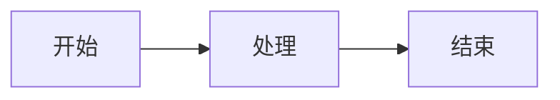

# Astro Obsidian 笔记网站 — 实施计划

> **For agentic workers:** REQUIRED SUB-SKILL: Use superpowers:subagent-driven-development (recommended) or superpowers:executing-plans to implement this plan task-by-task. Steps use checkbox (`- [ ]`) syntax for tracking.

**Goal:** 基于 Astro 5.x SSG 搭建一个完全兼容 Obsidian 的静态笔记网站，支持笔记展示、标签系统、全文搜索、关系图谱等功能。

**Architecture:** 混合流水线架构 — 独立 Transform 脚本处理跨文件关系(Wikilinks/Tags/Backlinks/Graph)，Astro SSG 负责页面生成和 remark 插件链处理文件内语法。中间数据以 JSON 缓存传递。

**Tech Stack:** Astro 5.x, remark/rehype 插件链, Pagefind, vis-network, KaTeX, CSS Custom Properties, Octicons

**设计文档:** [设计文档](../specs/2026-06-02-astro-obsidian-note-design.md)

---

## 文件结构总览

### 新建文件

```
src/
├── remark-plugins/
│   ├── remark-wikilinks.mjs
│   ├── remark-obsidian-callout.mjs
│   ├── remark-obsidian-embed.mjs
│   └── remark-obsidian-highlight.mjs
├── lib/
│   ├── notes.ts
│   ├── tags.ts
│   ├── graph.ts
│   └── wikilinks.ts
├── pages/
│   ├── index.astro
│   ├── notes/
│   │   └── [...path].astro
│   ├── tags/
│   │   ├── index.astro
│   │   └── [tag].astro
│   ├── search.astro
│   ├── graph.astro
│   └── 404.astro
├── components/
│   ├── Header.astro
│   ├── Sidebar.astro
│   ├── Footer.astro
│   ├── NoteContent.astro
│   ├── Backlinks.astro
│   ├── TagBadge.astro
│   ├── TagList.astro
│   ├── SearchBox.astro
│   ├── GraphView.astro
│   ├── Callout.astro
│   ├── TableOfContents.astro
│   └── ThemeToggle.astro
├── layouts/
│   └── BaseLayout.astro
├── styles/
│   ├── base.css
│   ├── theme-light.css
│   ├── theme-dark.css
│   ├── github-markdown.css
│   └── components.css
└── content/
    └── notes/          (从 vault 同步，初始放演示笔记)
scripts/
├── sync-notes.sh
└── process-data.mjs
astro.config.mjs
tsconfig.json
package.json
```

---

## Phase 1: 项目脚手架

### Task 1.1: 初始化 Astro 项目

**Files:**
- Create: `package.json`
- Create: `astro.config.mjs`
- Create: `tsconfig.json`
- Create: `src/env.d.ts`

- [ ] **Step 1: 初始化项目目录并创建 package.json**

```bash
mkdir -p /Users/sy/hermes/codes/Astro-Obsidian-Note
cd /Users/sy/hermes/codes/Astro-Obsidian-Note
```

创建 `package.json`:

```json
{
  "name": "astro-obsidian-note",
  "type": "module",
  "version": "0.1.0",
  "private": true,
  "scripts": {
    "dev": "astro dev",
    "build": "astro build",
    "preview": "astro preview",
    "sync": "bash scripts/sync-notes.sh",
    "process": "node scripts/process-data.mjs"
  },
  "dependencies": {
    "astro": "^5.0.0",
    "rehype-katex": "^7.0.0",
    "remark-math": "^6.0.0",
    "remark-gfm": "^4.0.0",
    "katex": "^0.16.0",
    "pagefind": "^1.0.0",
    "vis-network": "^9.0.0",
    "mermaid": "^10.0.0",
    "@octicons/astro": "^0.0.1"
  },
  "devDependencies": {
    "@astrojs/sitemap": "^3.0.0",
    "typescript": "^5.0.0"
  }
}
```

- [ ] **Step 2: 创建 astro.config.mjs**

```js
// astro.config.mjs
import { defineConfig } from 'astro/config';
import sitemap from '@astrojs/sitemap';
import remarkMath from 'remark-math';
import remarkGfm from 'remark-gfm';
import rehypeKatex from 'rehype-katex';
import remarkWikilinks from './src/remark-plugins/remark-wikilinks.mjs';
import remarkObsidianCallout from './src/remark-plugins/remark-obsidian-callout.mjs';
import remarkObsidianEmbed from './src/remark-plugins/remark-obsidian-embed.mjs';
import remarkObsidianHighlight from './src/remark-plugins/remark-obsidian-highlight.mjs';

export default defineConfig({
  site: 'https://example.com', // 部署时替换
  output: 'static',
  markdown: {
    remarkPlugins: [
      remarkGfm,
      remarkMath,
      remarkWikilinks,
      remarkObsidianCallout,
      remarkObsidianEmbed,
      remarkObsidianHighlight,
    ],
    rehypePlugins: [
      rehypeKatex,
    ],
  },
  integrations: [sitemap()],
  srcDir: './src',
  publicDir: './public',
});
```

- [ ] **Step 3: 创建 tsconfig.json**

```json
{
  "extends": "astro/tsconfigs/strict",
  "compilerOptions": {
    "baseUrl": ".",
    "paths": {
      "@components/*": ["src/components/*"],
      "@layouts/*": ["src/layouts/*"],
      "@lib/*": ["src/lib/*"],
      "@styles/*": ["src/styles/*"]
    }
  }
}
```

- [ ] **Step 4: 创建目录结构**

```bash
mkdir -p src/{pages/notes,pages/tags,components,layouts,lib,styles,content/notes,remark-plugins}
mkdir -p scripts public doc
mkdir -p src/content/.data
```

- [ ] **Step 5: 创建 src/env.d.ts**

```ts
/// <reference path="../.astro/types.d.ts" />
/// <reference types="astro/client" />
```

- [ ] **Step 6: 安装依赖并验证**

```bash
npm install
npm run dev --help
# 验证 astro 命令可用
```

- [ ] **Step 7: 创建 .gitignore**

```
node_modules/
dist/
.DS_Store
*.local
```

- [ ] **Step 8: Commit**

```bash
git init
git add -A
git commit -m "feat: initialize Astro project scaffold"
```

### Task 1.2: 创建演示笔记

**Files:**
- Create: `src/content/notes/hello.md`
- Create: `src/content/notes/sub/demo.md`

- [ ] **Step 1: 创建演示笔记 hello.md**

```markdown
---
title: Hello Astro
date: 2026-06-02
tags: [astro, obsidian]
---

# Hello Astro

欢迎来到 Astro Obsidian 笔记站！

## Wikilink 测试

链接到 [[子目录/演示笔记|演示笔记]]

## Callout 测试

> [!note] 这是一个 Note 类型的 Callout
> 可以包含**多行**内容

> [!warning] 警告内容
> 请注意这是警告

## Highlight 测试

这是一段 ==高亮文本== 测试。

## Embed 测试

![[sub/demo.md]]

## 标签测试

行内标签 #demo #测试

## 数学公式

$$
E = mc^2
$$
```

- [ ] **Step 2: 创建子目录演示笔记 sub/demo.md**

```markdown
---
title: 演示笔记
date: 2026-06-02
tags: [demo]
---

# 演示笔记

这是子目录中的演示笔记。它被 [[hello]] 引用了。

## Mermaid 图表


```

- [ ] **Step 3: Commit**

```bash
git add -A
git commit -m "feat: add demo notes for development"
```

---

## Phase 2: Obsidian 兼容层 (remark 插件)

### Task 2.1: remark-wikilinks 插件

**Files:**
- Create: `src/remark-plugins/remark-wikilinks.mjs`

- [ ] **Step 1: 实现 remark-wikilinks 插件**

```js
// src/remark-plugins/remark-wikilinks.mjs
import { visit } from 'unist-util-visit';
import fs from 'fs';
import path from 'path';
import { fileURLToPath } from 'url';

const __dirname = path.dirname(fileURLToPath(import.meta.url));
const WIKILINK_MAP_PATH = path.resolve(__dirname, '../content/.data/wikilinks.json');

/**
 * remark 插件: 将 [[笔记名|别名]] 转为 <a> 标签
 * 读取 Transform 阶段生成的 wikilinks.json 进行 URL 映射
 */
export default function remarkWikilinks(options = {}) {
  // 允许通过选项注入映射（方便测试），否则从文件读取
  const wikilinkMap = options.wikilinkMap || loadWikilinkMap();
  
  const WIKILINK_REGEX = /\[\[([^\[\]|]+)(?:\|([^\[\]]+))?\]\]/g;

  return (tree, file) => {
    visit(tree, 'text', (node, index, parent) => {
      if (!parent || typeof node.value !== 'string') return;
      
      const matches = [...node.value.matchAll(WIKILINK_REGEX)];
      if (matches.length === 0) return;

      // 将文本节点替换为 文本+链接 混合节点
      const parts = [];
      let lastIndex = 0;
      
      for (const match of matches) {
        const fullMatch = match[0];
        const linkTarget = match[1].trim();
        const displayText = (match[2] || linkTarget).trim();
        const matchStart = match.index;
        
        // 匹配前的纯文本
        if (matchStart > lastIndex) {
          parts.push({
            type: 'text',
            value: node.value.slice(lastIndex, matchStart),
          });
        }
        
        // 查找 URL 映射
        const resolved = wikilinkMap[linkTarget] || wikilinkMap[`${linkTarget}|${displayText}`];
        const url = resolved ? resolved.path : `/notes/${encodeURIComponent(linkTarget)}`;
        const isBroken = !resolved;
        
        parts.push({
          type: 'link',
          url: url,
          title: null,
          data: {
            hProperties: {
              class: isBroken ? 'wikilink wikilink-broken' : 'wikilink',
              'data-wikilink': linkTarget,
            },
            hName: 'a',
          },
          children: [{ type: 'text', value: displayText }],
        });
        
        lastIndex = matchStart + fullMatch.length;
      }
      
      // 尾部文本
      if (lastIndex < node.value.length) {
        parts.push({
          type: 'text',
          value: node.value.slice(lastIndex),
        });
      }
      
      // 替换父节点的原文本节点为多节点
      parent.children.splice(index, 1, ...parts);
      return index + parts.length; // 跳过已处理的节点
    });
  };
}

function loadWikilinkMap() {
  try {
    if (fs.existsSync(WIKILINK_MAP_PATH)) {
      return JSON.parse(fs.readFileSync(WIKILINK_MAP_PATH, 'utf-8'));
    }
  } catch (e) {
    console.warn('⚠️ wikilinks.json not found, Wikilinks will render as broken links');
  }
  return {};
}
```

- [ ] **Step 2: 手动验证** (通过查看演示笔记的渲染结果确认)

```bash
# 后续创建 pages 后通过 dev server 验证
echo "插件创建完成，将在 Phase 4 页面渲染时验证"
```

- [ ] **Step 3: Commit**

```bash
git add -A
git commit -m "feat: add remark-wikilinks plugin"
```

### Task 2.2: remark-obsidian-callout 插件

**Files:**
- Create: `src/remark-plugins/remark-obsidian-callout.mjs`

- [ ] **Step 1: 实现 callout 插件**

```js
// src/remark-plugins/remark-obsidian-callout.mjs
import { visit } from 'unist-util-visit';

const CALLOUT_REGEX = /^\[!(\w+)\]\s*(.*)/i;
const KNOWN_TYPES = ['note', 'warning', 'tip', 'important', 'caution', 'info', 'abstract', 'success', 'question', 'danger'];

/**
 * remark 插件: 将 > [!note] 格式的 blockquote 转换为 callout div
 * 支持嵌套: > [!note] > [!warning] 内层
 */
export default function remarkObsidianCallout() {
  return (tree) => {
    visit(tree, 'blockquote', (node, index, parent) => {
      if (!parent || !node.children || node.children.length === 0) return;

      const firstChild = node.children[0];
      if (firstChild.type !== 'paragraph' || !firstChild.children) return;

      const firstText = firstChild.children[0];
      if (!firstText || firstText.type !== 'text') return;

      const match = firstText.value.match(CALLOUT_REGEX);
      if (!match) return;

      const calloutType = match[1].toLowerCase();
      const restContent = match[2];

      // 从第一个段落移除 callout 标记前缀
      if (restContent) {
        firstText.value = restContent;
      } else {
        // 如果只有标记没有文字，移除空的第一个段落
        firstChild.children.shift();
        if (firstChild.children.length === 0) {
          node.children.shift();
        }
      }

      // 构建 callout 节点
      const calloutNode = {
        type: 'paragraph',
        data: {
          hName: 'div',
          hProperties: {
            class: `callout callout-${calloutType}`,
            'data-callout-type': calloutType,
          },
        },
        children: [
          {
            type: 'paragraph',
            data: { hName: 'div', hProperties: { class: 'callout-title' } },
            children: [
              {
                type: 'text',
                data: { hName: 'span', hProperties: { class: 'callout-icon' } },
                value: calloutType === 'note' ? '📝' : 
                       calloutType === 'warning' ? '⚠️' :
                       calloutType === 'tip' ? '💡' :
                       calloutType === 'important' ? '❗' :
                       calloutType === 'caution' ? '🚧' : '📌',
              },
              { type: 'text', value: calloutType.charAt(0).toUpperCase() + calloutType.slice(1) },
            ],
          },
          {
            type: 'paragraph',
            data: { hName: 'div', hProperties: { class: 'callout-body' } },
            children: node.children,
          },
        ],
      };

      parent.children.splice(index, 1, calloutNode);
      return index + 1;
    });
  };
}
```

- [ ] **Step 2: Commit**

```bash
git add -A
git commit -m "feat: add remark-obsidian-callout plugin"
```

### Task 2.3: remark-obsidian-highlight 插件

**Files:**
- Create: `src/remark-plugins/remark-obsidian-highlight.mjs`

- [ ] **Step 1: 实现 highlight 插件**

```js
// src/remark-plugins/remark-obsidian-highlight.mjs
import { visit } from 'unist-util-visit';

const HIGHLIGHT_REGEX = /==([^=]+)==/g;

/**
 * remark 插件: 将 ==高亮文本== 转为 <mark> 标签
 */
export default function remarkObsidianHighlight() {
  return (tree) => {
    visit(tree, 'text', (node, index, parent) => {
      if (!parent || typeof node.value !== 'string') return;

      const matches = [...node.value.matchAll(HIGHLIGHT_REGEX)];
      if (matches.length === 0) return;

      const parts = [];
      let lastIndex = 0;

      for (const match of matches) {
        const fullMatch = match[0];
        const highlightText = match[1];
        const matchStart = match.index;

        if (matchStart > lastIndex) {
          parts.push({ type: 'text', value: node.value.slice(lastIndex, matchStart) });
        }

        parts.push({
          type: 'text',
          value: highlightText,
          data: { hName: 'mark', hProperties: { class: 'obsidian-highlight' } },
        });

        lastIndex = matchStart + fullMatch.length;
      }

      if (lastIndex < node.value.length) {
        parts.push({ type: 'text', value: node.value.slice(lastIndex) });
      }

      parent.children.splice(index, 1, ...parts);
      return index + parts.length;
    });
  };
}
```

- [ ] **Step 2: Commit**

```bash
git add -A
git commit -m "feat: add remark-obsidian-highlight plugin"
```

### Task 2.4: remark-obsidian-embed 插件

**Files:**
- Create: `src/remark-plugins/remark-obsidian-embed.mjs`

- [ ] **Step 1: 实现 embed 插件**

```js
// src/remark-plugins/remark-obsidian-embed.mjs
import { visit } from 'unist-util-visit';
import fs from 'fs';
import path from 'path';
import { fileURLToPath } from 'url';

const __dirname = path.dirname(fileURLToPath(import.meta.url));
const CONTENT_DIR = path.resolve(__dirname, '../content/notes');

const EMBED_REGEX = /!\[\[([^\[\]]+)\]\]/g;
const IMAGE_EXTENSIONS = ['.png', '.jpg', '.jpeg', '.webp', '.gif', '.svg'];

/**
 * remark 插件: 将 ![[文件]] 解析为嵌入内容
 * - 图片文件 (.png/.jpg/...) → 
 * - Markdown 文件 (.md) → 内联笔记内容（递归警告保护）
 */
export default function remarkObsidianEmbed(options = {}) {
  const contentDir = options.contentDir || CONTENT_DIR;

  return (tree, file) => {
    visit(tree, 'text', (node, index, parent) => {
      if (!parent || typeof node.value !== 'string') return;

      const matches = [...node.value.matchAll(EMBED_REGEX)];
      if (matches.length === 0) return;

      const parts = [];
      let lastIndex = 0;

      for (const match of matches) {
        const fullMatch = match[0];
        const embedTarget = match[1].trim();
        const matchStart = match.index;

        if (matchStart > lastIndex) {
          parts.push({ type: 'text', value: node.value.slice(lastIndex, matchStart) });
        }

        const ext = path.extname(embedTarget).toLowerCase();
        const isImage = IMAGE_EXTENSIONS.includes(ext);

        if (isImage) {
          // 图片嵌入 → 
          const imgPath = `/notes/${embedTarget}`;
          parts.push({
            type: 'image',
            url: imgPath,
            alt: embedTarget,
            title: null,
          });
        } else if (ext === '.md' || !ext) {
          // Markdown 嵌入 → 尝试读取文件内容
          const mdPath = resolveEmbedPath(contentDir, embedTarget);
          if (mdPath && fs.existsSync(mdPath)) {
            const content = fs.readFileSync(mdPath, 'utf-8');
            // 提取 YAML frontmatter 后的正文（简单处理）
            const body = content.replace(/^---[\s\S]*?---\n*/, '');
            // 将嵌入内容作为代码块显示（避免递归解析）
            parts.push({
              type: 'text',
              value: body,
            });
          } else {
            parts.push({
              type: 'text',
              value: '⚠️ 嵌入文件不存在',
              data: { hName: 'span', hProperties: { class: 'embed-broken' } },
            });
          }
        } else {
          // 其他文件类型 → 下载链接
          parts.push({
            type: 'link',
            url: `/notes/${embedTarget}`,
            title: embedTarget,
            children: [{ type: 'text', value: `📎 ${embedTarget}` }],
          });
        }

        lastIndex = matchStart + fullMatch.length;
      }

      if (lastIndex < node.value.length) {
        parts.push({ type: 'text', value: node.value.slice(lastIndex) });
      }

      parent.children.splice(index, 1, ...parts);
      return index + parts.length;
    });
  };
}

function resolveEmbedPath(contentDir, target) {
  // 支持路径如 sub/file.md 或 file
  const withExt = target.endsWith('.md') ? target : `${target}.md`;
  const fullPath = path.join(contentDir, withExt);
  if (fs.existsSync(fullPath)) return fullPath;

  // 尝试不带 .md
  if (target.endsWith('.md')) return null;
  const noExtPath = path.join(contentDir, target);
  if (fs.existsSync(noExtPath)) return noExtPath;

  return null;
}
```

- [ ] **Step 2: Commit**

```bash
git add -A
git commit -m "feat: add remark-obsidian-embed plugin"
```

---

## Phase 3: 数据处理脚本

### Task 3.1: Transform 脚本 — 核心框架

**Files:**
- Create: `scripts/process-data.mjs`

- [ ] **Step 1: 创建 process-data.mjs 框架**

```js
// scripts/process-data.mjs
import fs from 'fs';
import path from 'path';
import { fileURLToPath } from 'url';

const __dirname = path.dirname(fileURLToPath(import.meta.url));
const CONTENT_DIR = path.resolve(__dirname, '../src/content/notes');
const DATA_DIR = path.resolve(__dirname, '../src/content/.data');

// 确保 .data 目录存在
if (!fs.existsSync(DATA_DIR)) {
  fs.mkdirSync(DATA_DIR, { recursive: true });
}

// 扫描所有 .md 文件
function scanMarkdownFiles(dir) {
  const entries = [];
  for (const entry of fs.readdirSync(dir, { withFileTypes: true })) {
    const fullPath = path.join(dir, entry.name);
    if (entry.isDirectory()) {
      entries.push(...scanMarkdownFiles(fullPath));
    } else if (entry.name.endsWith('.md')) {
      entries.push(fullPath);
    }
  }
  return entries;
}

// 解析 YAML frontmatter（简化版，不依赖外部库）
function parseFrontmatter(content) {
  const match = content.match(/^---\n([\s\S]*?)\n---\n/);
  if (!match) return { frontmatter: {}, body: content };

  const yamlBlock = match[1];
  const body = content.slice(match[0].length);
  const frontmatter = {};

  for (const line of yamlBlock.split('\n')) {
    const kvMatch = line.match(/^(\w+):\s*(.*)/);
    if (kvMatch) {
      let value = kvMatch[2].trim();
      // 解析 YAML 数组: [a, b, c]
      if (value.startsWith('[') && value.endsWith(']')) {
        value = value.slice(1, -1).split(',').map(s => s.trim().replace(/^['"]|['"]$/g, ''));
      }
      frontmatter[kvMatch[1]] = value;
    }
  }

  return { frontmatter, body };
}

// 提取 Wikilinks [[target|text]]
function extractWikilinks(body, relativePath) {
  const links = [];
  const regex = /\[\[([^\[\]|]+)(?:\|([^\[\]]+))?\]\]/g;
  let match;
  while ((match = regex.exec(body)) !== null) {
    links.push({
      target: match[1].trim(),
      displayText: (match[2] || match[1]).trim(),
    });
  }
  return links;
}

// 提取行内标签 #tag
function extractInlineTags(body) {
  const tags = [];
  const regex = /(?:^|\s)#([\p{L}\p{N}_-]+)/gu;
  let match;
  while ((match = regex.exec(body)) !== null) {
    tags.push(match[1]);
  }
  return tags;
}

// === 主流程 ===
const files = scanMarkdownFiles(CONTENT_DIR);
console.log(`📁 扫描到 ${files.length} 个笔记文件`);

// 第一阶段: 提取原始数据
const notesData = [];
const wikilinkMap = {};    // { targetName: { path, slug } }
const allTags = {};         // { tagName: Set<slug> }
const backlinks = {};       // { slug: [{ source, displayText }] }

for (const filePath of files) {
  const content = fs.readFileSync(filePath, 'utf-8');
  const { frontmatter, body } = parseFrontmatter(content);
  const relativePath = path.relative(CONTENT_DIR, filePath).replace(/\.md$/, '');
  const slug = `notes/${relativePath}`;

  const wikilinks = extractWikilinks(body, relativePath);
  const inlineTags = extractInlineTags(body);
  const tags = [...new Set([
    ...(Array.isArray(frontmatter.tags) ? frontmatter.tags : []),
    ...inlineTags,
  ])];

  notesData.push({
    slug,
    path: `/notes/${encodeURIComponent(relativePath)}`,
    title: frontmatter.title || path.basename(relativePath),
    date: frontmatter.date || null,
    tags,
    wikilinks,
    filePath,
  });

  // 建立 Wikilink 映射
  const displayName = path.basename(relativePath, '.md');
  wikilinkMap[displayName] = { path: `/notes/${encodeURIComponent(relativePath)}`, slug };
  wikilinkMap[relativePath] = { path: `/notes/${encodeURIComponent(relativePath)}`, slug };
  // 也支持带扩展名的形式
  wikilinkMap[`${relativePath}.md`] = { path: `/notes/${encodeURIComponent(relativePath)}`, slug };

  // 收集标签
  for (const tag of tags) {
    if (!allTags[tag]) allTags[tag] = new Set();
    allTags[tag].add(slug);
  }

  // 初始化 backlinks 条目
  if (!backlinks[slug]) backlinks[slug] = [];
}

// 第二阶段: 计算 Backlinks
for (const note of notesData) {
  for (const wl of note.wikilinks) {
    const resolved = wikilinkMap[wl.target];
    if (resolved && resolved.slug !== note.slug) {
      if (!backlinks[resolved.slug]) backlinks[resolved.slug] = [];
      backlinks[resolved.slug].push({
        source: note.path,
        sourceTitle: note.title,
        displayText: wl.displayText,
      });
    }
  }
}

// 第三阶段: 生成图谱数据
const graphNodes = notesData.map(note => ({
  id: note.slug,
  label: note.title,
  size: Math.max(3, (backlinks[note.slug]?.length || 0) * 2 + 3),
  title: note.title,
}));

const graphEdges = [];
for (const note of notesData) {
  for (const wl of note.wikilinks) {
    const resolved = wikilinkMap[wl.target];
    if (resolved && resolved.slug !== note.slug) {
      graphEdges.push({
        from: note.slug,
        to: resolved.slug,
      });
    }
  }
}

// 写入输出文件
// wikilinks.json
fs.writeFileSync(
  path.join(DATA_DIR, 'wikilinks.json'),
  JSON.stringify(wikilinkMap, null, 2),
  'utf-8'
);

// tags.json — 将 Set 转为数组
const tagsJson = {};
for (const [tag, noteSet] of Object.entries(allTags)) {
  tagsJson[tag] = {
    notes: notesData.filter(n => noteSet.has(n.slug)).map(n => ({
      path: n.path,
      title: n.title,
    })),
    count: noteSet.size,
  };
}
fs.writeFileSync(
  path.join(DATA_DIR, 'tags.json'),
  JSON.stringify(tagsJson, null, 2),
  'utf-8'
);

// backlinks.json
fs.writeFileSync(
  path.join(DATA_DIR, 'backlinks.json'),
  JSON.stringify(backlinks, null, 2),
  'utf-8'
);

// graph.json (去重 edges)
const edgeKeySet = new Set();
const uniqueEdges = graphEdges.filter(e => {
  const key = `${e.from}|${e.to}`;
  if (edgeKeySet.has(key)) return false;
  edgeKeySet.add(key);
  return true;
});

fs.writeFileSync(
  path.join(DATA_DIR, 'graph.json'),
  JSON.stringify({ nodes: graphNodes, edges: uniqueEdges }, null, 2),
  'utf-8'
);

console.log(`✅ 数据处理完成`);
console.log(`   wikilinks.json — ${Object.keys(wikilinkMap).length} 个映射条目`);
console.log(`   tags.json — ${Object.keys(tagsJson).length} 个标签`);
console.log(`   backlinks.json — ${Object.keys(backlinks).length} 个笔记的反向链接`);
console.log(`   graph.json — ${graphNodes.length} 个节点, ${uniqueEdges.length} 条边`);
```

- [ ] **Step 2: 运行验证**

```bash
node scripts/process-data.mjs
# 预期输出: 扫描到 2 个笔记文件
# 验证 src/content/.data/ 下生成 4 个 JSON 文件
ls -la src/content/.data/
```

- [ ] **Step 3: Commit**

```bash
git add -A
git commit -m "feat: add data processing transform script"
```

### Task 3.2: 数据工具库 — TypeScript 类型定义

**Files:**
- Create: `src/lib/wikilinks.ts`
- Create: `src/lib/notes.ts`
- Create: `src/lib/tags.ts`
- Create: `src/lib/graph.ts`

- [ ] **Step 1: 创建 wikilinks.ts**

```ts
// src/lib/wikilinks.ts

export interface WikilinkEntry {
  path: string;
  slug: string;
  alias?: string;
}

export interface WikilinkMap {
  [targetName: string]: WikilinkEntry;
}

export interface BacklinkItem {
  source: string;
  sourceTitle: string;
  displayText: string;
}

export interface BacklinkMap {
  [slug: string]: BacklinkItem[];
}
```

- [ ] **Step 2: 创建 notes.ts**

```ts
// src/lib/notes.ts

export interface NoteMeta {
  slug: string;
  path: string;
  title: string;
  date: string | null;
  tags: string[];
}

export interface NoteEntry {
  slug: string;
  path: string;
  title: string;
  date: string | null;
  tags: string[];
  wikilinks: string[];
  backlinks: BacklinkItem[];
}
```

- [ ] **Step 3: 创建 tags.ts**

```ts
// src/lib/tags.ts

export interface TagInfo {
  notes: { path: string; title: string }[];
  count: number;
}

export interface TagMap {
  [tag: string]: TagInfo;
}
```

- [ ] **Step 4: 创建 graph.ts**

```ts
// src/lib/graph.ts

export interface GraphNode {
  id: string;
  label: string;
  size: number;
  title: string;
}

export interface GraphEdge {
  from: string;
  to: string;
}

export interface GraphData {
  nodes: GraphNode[];
  edges: GraphEdge[];
}
```

- [ ] **Step 5: Commit**

```bash
git add -A
git commit -m "feat: add TypeScript type definitions for data layer"
```

---

## Phase 4: 页面与路由

### Task 4.1: BaseLayout 布局

**Files:**
- Create: `src/layouts/BaseLayout.astro`

- [ ] **Step 1: 创建 BaseLayout.astro**

```astro
---
// src/layouts/BaseLayout.astro
export interface Props {
  title: string;
  description?: string;
  image?: string;
}

const { title, description, image } = Astro.props;
const siteTitle = `${title} | Astro Notes`;
---

<!DOCTYPE html>
<html lang="zh-CN" data-theme="light">
<head>
  <meta charset="UTF-8" />
  <meta name="viewport" content="width=device-width, initial-scale=1.0" />
  <title>{siteTitle}</title>
  <meta name="description" content={description || title} />
  <meta property="og:title" content={siteTitle} />
  <meta property="og:description" content={description || title} />
  {image && <meta property="og:image" content={image} />}
  <meta property="og:type" content="website" />
  <meta name="twitter:card" content="summary_large_image" />
  <link rel="icon" type="image/svg+xml" href="/favicon.svg" />

  <!-- 主题初始化（防闪烁） -->
  <script is:inline>
    (function() {
      const theme = localStorage.getItem('theme') || 
        (window.matchMedia('(prefers-color-scheme: dark)').matches ? 'dark' : 'light');
      document.documentElement.setAttribute('data-theme', theme);
    })();
  </script>

  <!-- KaTeX CSS -->
  <link rel="stylesheet" href="https://cdn.jsdelivr.net/npm/katex@0.16.0/dist/katex.min.css" />

  <!-- 全局样式 -->
  <link rel="stylesheet" href="/styles/base.css" />
  <link rel="stylesheet" href="/styles/theme-light.css" />
  <link rel="stylesheet" href="/styles/theme-dark.css" />
  <link rel="stylesheet" href="/styles/github-markdown.css" />
  <link rel="stylesheet" href="/styles/components.css" />
</head>
<body>
  <slot />
</body>
</html>
```

- [ ] **Step 2: Commit**

```bash
git add -A
git commit -m "feat: add BaseLayout with SEO and theme initialization"
```

### Task 4.2: 首页

**Files:**
- Create: `src/pages/index.astro`

- [ ] **Step 1: 创建首页**

```astro
---
// src/pages/index.astro
import BaseLayout from '@layouts/BaseLayout.astro';
import fs from 'fs';
import path from 'path';
import { fileURLToPath } from 'url';

const __dirname = path.dirname(fileURLToPath(import.meta.url));
const DATA_DIR = path.resolve(__dirname, '../content/.data');

const tagsPath = path.join(DATA_DIR, 'tags.json');
const backlinksPath = path.join(DATA_DIR, 'backlinks.json');

let tagCount = 0;
let noteCount = 0;
let latestNotes = [];

try {
  const tags = JSON.parse(fs.readFileSync(tagsPath, 'utf-8'));
  const backlinks = JSON.parse(fs.readFileSync(backlinksPath, 'utf-8'));
  tagCount = Object.keys(tags).length;
  noteCount = Object.keys(backlinks).length;

  // 读取笔记列表（从文件系统中获取）
  const notesDir = path.resolve(__dirname, '../content/notes');
  const noteFiles = fs.readdirSync(notesDir, { recursive: true })
    .filter(f => f.endsWith('.md'))
    .slice(0, 10)
    .map(f => ({
      title: path.basename(f, '.md'),
      path: `/notes/${f.replace(/\.md$/, '')}`,
    }));
  latestNotes = noteFiles;
} catch (e) {
  console.warn('⚠️ 数据文件未找到，请先运行 npm run process');
}
---

<BaseLayout title="首页" description="Astro Obsidian 笔记站">
  <div class="home-page">
    <header class="home-header">
      <h1>📝 Astro Notes</h1>
      <p class="home-subtitle">基于 Obsidian 的静态笔记站点</p>
    </header>

    <div class="stats-grid">
      <div class="stat-card">
        <div class="stat-number">{noteCount}</div>
        <div class="stat-label">笔记</div>
      </div>
      <div class="stat-card">
        <div class="stat-number">{tagCount}</div>
        <div class="stat-label">标签</div>
      </div>
    </div>

    <section class="latest-notes">
      <h2>最新笔记</h2>
      <ul>
        {latestNotes.map(note => (
          <li><a href={note.path}>{note.title}</a></li>
        ))}
      </ul>
    </section>
  </div>
</BaseLayout>

<style>
  .home-page { max-width: 800px; margin: 0 auto; padding: 2rem; }
  .home-header { text-align: center; margin-bottom: 3rem; }
  .home-subtitle { color: var(--color-text-secondary); }
  .stats-grid { display: flex; gap: 1rem; justify-content: center; margin-bottom: 3rem; }
  .stat-card {
    background: var(--color-bg-secondary);
    border: 1px solid var(--color-border);
    border-radius: 6px;
    padding: 1.5rem 2rem;
    text-align: center;
    min-width: 120px;
  }
  .stat-number { font-size: 2rem; font-weight: 600; color: var(--color-link); }
  .stat-label { font-size: 0.875rem; color: var(--color-text-secondary); }
  .latest-notes ul { list-style: none; padding: 0; }
  .latest-notes li { padding: 0.5rem 0; border-bottom: 1px solid var(--color-border); }
  .latest-notes a { color: var(--color-link); text-decoration: none; }
  .latest-notes a:hover { text-decoration: underline; }
</style>
```

- [ ] **Step 2: 创建 styles 目录的占位文件**

```css
/* src/styles/base.css */
*, *::before, *::after { box-sizing: border-box; margin: 0; padding: 0; }
html { font-size: 16px; scroll-behavior: smooth; }
body {
  font-family: -apple-system, BlinkMacSystemFont, 'Segoe UI', 'Noto Sans', Helvetica, Arial, sans-serif;
  line-height: 1.6;
  color: var(--color-text-primary);
  background-color: var(--color-bg-primary);
}
a { color: var(--color-link); text-decoration: none; }
a:hover { text-decoration: underline; }
img { max-width: 100%; height: auto; }
code { font-family: SFMono-Regular, Consolas, 'Liberation Mono', Menlo, monospace; }
```

```css
/* src/styles/theme-light.css */
:root {
  --color-bg-primary: #ffffff;
  --color-bg-secondary: #f6f8fa;
  --color-bg-tertiary: #eaeef2;
  --color-text-primary: #1f2328;
  --color-text-secondary: #656d76;
  --color-link: #0969da;
  --color-border: #d0d7de;
  --color-accent: #2da44e;
  --color-danger: #cf222e;
  --font-sans: -apple-system, BlinkMacSystemFont, 'Segoe UI', 'Noto Sans', Helvetica, Arial, sans-serif;
  --font-mono: SFMono-Regular, Consolas, 'Liberation Mono', Menlo, monospace;
  --space-1: 4px;
  --space-2: 8px;
  --space-3: 16px;
  --space-4: 24px;
  --sidebar-width: 280px;
  --header-height: 56px;
  --content-max-width: 800px;
}
```

```css
/* src/styles/theme-dark.css */
[data-theme="dark"] {
  --color-bg-primary: #0d1117;
  --color-bg-secondary: #161b22;
  --color-bg-tertiary: #21262d;
  --color-text-primary: #e6edf3;
  --color-text-secondary: #8b949e;
  --color-link: #58a6ff;
  --color-border: #30363d;
  --color-accent: #3fb950;
  --color-danger: #f85149;
}
```

```css
/* src/styles/components.css */
/* 占位 — Phase 5 和 6 会填充 */
```

- [ ] **Step 3: 创建 favicon**

```bash
# 创建一个简单的 SVG favicon
cat > public/favicon.svg << 'EOF'
<svg xmlns="http://www.w3.org/2000/svg" viewBox="0 0 100 100">
  <text y="0.9em" font-size="80">📝</text>
</svg>
EOF
```

- [ ] **Step 4: 验证首页可访问**

```bash
# Astro 开发模式下访问 http://localhost:4321
npm run dev
```

- [ ] **Step 5: Commit**

```bash
git add -A
git commit -m "feat: add home page with stats and latest notes"
```

### Task 4.2: 笔记详情页 (动态路由)

**Files:**
- Create: `src/pages/notes/[...path].astro`

- [ ] **Step 1: 创建笔记详情页**

```astro
---
// src/pages/notes/[...path].astro
import BaseLayout from '@layouts/BaseLayout.astro';
import { Content, getCollection } from 'astro:content';
import fs from 'fs';
import path from 'path';
import { fileURLToPath } from 'url';

const __dirname = path.dirname(fileURLToPath(import.meta.url));
const DATA_DIR = path.resolve(__dirname, '../../content/.data');

export async function getStaticPaths() {
  const notesDir = path.resolve(__dirname, '../../content/notes');
  const entries = [];

  function scan(dir, prefix = '') {
    for (const entry of fs.readdirSync(dir, { withFileTypes: true })) {
      if (entry.isDirectory()) {
        scan(path.join(dir, entry.name), `${prefix}${entry.name}/`);
      } else if (entry.name.endsWith('.md')) {
        const slug = `${prefix}${entry.name.replace(/\.md$/, '')}`;
        entries.push({
          params: { path: slug },
          props: { slug },
        });
      }
    }
  }
  scan(notesDir);

  return entries;
}

const { slug } = Astro.props;
const { Content } = await Astro.render(`/src/content/notes/${slug}.md`);

// 读取元数据
let backlinks = [];
let tags = [];
let title = slug.split('/').pop();

try {
  const backlinksData = JSON.parse(
    fs.readFileSync(path.join(DATA_DIR, 'backlinks.json'), 'utf-8')
  );
  const fullSlug = `notes/${slug}`;
  backlinks = backlinksData[fullSlug] || [];

  const tagsData = JSON.parse(
    fs.readFileSync(path.join(DATA_DIR, 'tags.json'), 'utf-8')
  );
  // 查找当前笔记的标签
  for (const [tag, info] of Object.entries(tagsData)) {
    if (info.notes.some(n => n.path === `/notes/${encodeURIComponent(slug)}`)) {
      tags.push(tag);
    }
  }
} catch (e) {
  // 无数据文件时静默处理
}
---

<BaseLayout title={title} description={`笔记: ${title}`}>
  <div class="note-page">
    <aside class="sidebar">
      <!-- 侧栏 - Phase 5 填充 Sidebar 组件 -->
      <nav class="sidebar-nav">
        <div class="sidebar-title">目录</div>
      </nav>
    </aside>

    <main class="note-content">
      <article class="markdown-body">
        <header class="note-header">
          <h1>{title}</h1>
          <div class="note-meta">
            {tags.length > 0 && (
              <div class="note-tags">
                {tags.map(tag => (
                  <a href={`/tags/${tag}`} class="tag-badge">#{tag}</a>
                ))}
              </div>
            )}
          </div>
        </header>

        <Content />
      </article>

      {backlinks.length > 0 && (
        <section class="backlinks">
          <h2>被引用</h2>
          <ul>
            {backlinks.map(bl => (
              <li><a href={bl.source}>{bl.sourceTitle}</a></li>
            ))}
          </ul>
        </section>
      )}
    </main>
  </div>
</BaseLayout>

<style>
  .note-page {
    display: flex;
    max-width: 1280px;
    margin: 0 auto;
    min-height: calc(100vh - var(--header-height));
  }
  .sidebar {
    width: var(--sidebar-width);
    padding: var(--space-4);
    border-right: 1px solid var(--color-border);
    flex-shrink: 0;
  }
  .note-content {
    flex: 1;
    padding: var(--space-4);
    max-width: var(--content-max-width);
  }
  .note-header { margin-bottom: var(--space-4); }
  .note-meta { margin-top: var(--space-2); }
  .note-tags { display: flex; gap: var(--space-2); flex-wrap: wrap; }
  .tag-badge {
    display: inline-block;
    padding: 2px 8px;
    font-size: 0.75rem;
    font-weight: 500;
    border-radius: 12px;
    background: var(--color-bg-tertiary);
    color: var(--color-link);
    border: 1px solid var(--color-border);
  }
  .tag-badge:hover { text-decoration: none; opacity: 0.8; }
  .backlinks {
    margin-top: var(--space-4);
    padding-top: var(--space-4);
    border-top: 1px solid var(--color-border);
  }
  .backlinks h2 { font-size: 1rem; margin-bottom: var(--space-2); }
  .backlinks ul { list-style: none; padding: 0; }
  .backlinks li { padding: 4px 0; }
  .backlinks a { color: var(--color-link); }

  /* 响应式 */
  @media (max-width: 768px) {
    .sidebar { display: none; }
    .note-content { max-width: 100%; }
  }
</style>
```

- [ ] **Step 2: 验证笔记详情页**

```bash
# 访问 http://localhost:4321/notes/hello
# 验证 Wikilinks/ Callout/ Highlight 等已正确渲染
echo "手动验证浏览器中笔记页的渲染效果"
```

- [ ] **Step 3: Commit**

```bash
git add -A
git commit -m "feat: add dynamic note detail page [...path].astro"
```

### Task 4.3: 标签页

**Files:**
- Create: `src/pages/tags/index.astro`
- Create: `src/pages/tags/[tag].astro`

- [ ] **Step 1: 创建标签总览页**

```astro
---
// src/pages/tags/index.astro
import BaseLayout from '@layouts/BaseLayout.astro';
import fs from 'fs';
import path from 'path';
import { fileURLToPath } from 'url';

const __dirname = path.dirname(fileURLToPath(import.meta.url));
const tagsPath = path.resolve(__dirname, '../../content/.data/tags.json');

let tags = {};
try {
  tags = JSON.parse(fs.readFileSync(tagsPath, 'utf-8'));
} catch (e) {
  console.warn('⚠️ tags.json 未找到');
}
---

<BaseLayout title="标签" description="所有标签">
  <div class="tags-page">
    <h1>🏷️ 标签</h1>
    <div class="tags-cloud">
      {Object.entries(tags)
        .sort(([, a], [, b]) => b.count - a.count)
        .map(([tag, info]) => (
          <a href={`/tags/${encodeURIComponent(tag)}`} class="tag-cloud-item" style={`font-size: ${Math.min(1.5, 0.8 + info.count * 0.15)}rem;`}>
            #{tag}
            <span class="tag-count">{info.count}</span>
          </a>
        ))
      }
    </div>
  </div>
</BaseLayout>

<style>
  .tags-page { max-width: 800px; margin: 0 auto; padding: 2rem; }
  .tags-cloud { display: flex; flex-wrap: wrap; gap: 0.75rem 1rem; margin-top: 2rem; align-items: center; }
  .tag-cloud-item {
    display: inline-flex; align-items: center; gap: 4px;
    padding: 4px 12px; border-radius: 16px;
    background: var(--color-bg-secondary); border: 1px solid var(--color-border);
    color: var(--color-link); text-decoration: none; transition: all 0.2s;
  }
  .tag-cloud-item:hover { background: var(--color-bg-tertiary); text-decoration: none; }
  .tag-count { font-size: 0.75rem; color: var(--color-text-secondary); }
</style>
```

- [ ] **Step 2: 创建标签筛选页**

```astro
---
// src/pages/tags/[tag].astro
import BaseLayout from '@layouts/BaseLayout.astro';
import fs from 'fs';
import path from 'path';
import { fileURLToPath } from 'url';

const __dirname = path.dirname(fileURLToPath(import.meta.url));
const tagsPath = path.resolve(__dirname, '../../content/.data/tags.json');

export async function getStaticPaths() {
  let tags = {};
  try {
    tags = JSON.parse(fs.readFileSync(tagsPath, 'utf-8'));
  } catch (e) {}
  return Object.keys(tags).map(tag => ({
    params: { tag: encodeURIComponent(tag) },
    props: { tag, notes: tags[tag].notes },
  }));
}

const { tag, notes } = Astro.props;
---

<BaseLayout title={`标签: ${tag}`} description={`标签 ${tag} 下的笔记`}>
  <div class="tag-page">
    <nav class="breadcrumb">
      <a href="/tags">标签</a> / <span>#{tag}</span>
    </nav>

    <h1># {tag}</h1>
    <p class="note-count">{notes.length} 篇笔记</p>

    <ul class="note-list">
      {notes.map(note => (
        <li>
          <a href={note.path}>{note.title}</a>
        </li>
      ))}
    </ul>
  </div>
</BaseLayout>

<style>
  .tag-page { max-width: 800px; margin: 0 auto; padding: 2rem; }
  .breadcrumb { font-size: 0.875rem; color: var(--color-text-secondary); margin-bottom: 1rem; }
  .breadcrumb a { color: var(--color-text-secondary); }
  .note-count { color: var(--color-text-secondary); margin: 0.5rem 0 1.5rem; }
  .note-list { list-style: none; padding: 0; }
  .note-list li { padding: 0.75rem 0; border-bottom: 1px solid var(--color-border); }
  .note-list a { color: var(--color-link); font-size: 1.05rem; }
</style>
```

- [ ] **Step 3: 验证标签页**

```bash
# 访问 http://localhost:4321/tags/  和  http://localhost:4321/tags/astro
```

- [ ] **Step 4: Commit**

```bash
git add -A
git commit -m "feat: add tag overview and filtered tag pages"
```

### Task 4.4: 404 页面

**Files:**
- Create: `src/pages/404.astro`

- [ ] **Step 1: 创建 404 页面**

```astro
---
// src/pages/404.astro
import BaseLayout from '@layouts/BaseLayout.astro';
---

<BaseLayout title="页面未找到">
  <div class="not-found">
    <h1>404</h1>
    <p>页面不存在</p>
    <a href="/" class="back-home">返回首页</a>
  </div>
</BaseLayout>

<style>
  .not-found { text-align: center; padding: 6rem 2rem; }
  .not-found h1 { font-size: 4rem; color: var(--color-text-secondary); margin-bottom: 1rem; }
  .not-found p { font-size: 1.25rem; color: var(--color-text-secondary); margin-bottom: 2rem; }
  .back-home { display: inline-block; padding: 0.5rem 1.5rem; background: var(--color-link); color: #fff; border-radius: 6px; }
  .back-home:hover { text-decoration: none; opacity: 0.9; }
</style>
```

- [ ] **Step 2: Commit**

```bash
git add -A
git commit -m "feat: add custom 404 page"
```

---

## Phase 5: UI 组件与布局

### Task 5.1: Header 组件

**Files:**
- Create: `src/components/Header.astro`

- [ ] **Step 1: 创建 Header**

```astro
---
// src/components/Header.astro
---

<header class="site-header">
  <div class="header-left">
    <a href="/" class="header-logo">
      <span class="logo-icon">📝</span>
      <span class="logo-text">Astro Notes</span>
    </a>
  </div>

  <nav class="header-nav">
    <a href="/">首页</a>
    <a href="/tags">标签</a>
    <a href="/search">搜索</a>
    <a href="/graph">图谱</a>
  </nav>

  <div class="header-right">
    <button id="theme-toggle" class="theme-btn" aria-label="切换主题">
      <span class="theme-icon-light">☀️</span>
      <span class="theme-icon-dark">🌙</span>
    </button>
  </div>
</header>

<script>
  const btn = document.getElementById('theme-toggle');
  if (btn) {
    btn.addEventListener('click', () => {
      const html = document.documentElement;
      const current = html.getAttribute('data-theme');
      const next = current === 'dark' ? 'light' : 'dark';
      html.setAttribute('data-theme', next);
      localStorage.setItem('theme', next);
    });
  }
</script>

<style>
  .site-header {
    display: flex; align-items: center; justify-content: space-between;
    height: var(--header-height); padding: 0 var(--space-4);
    border-bottom: 1px solid var(--color-border);
    background: var(--color-bg-primary);
    position: sticky; top: 0; z-index: 100;
  }
  .header-left { display: flex; align-items: center; }
  .header-logo { display: flex; align-items: center; gap: 8px; text-decoration: none; color: var(--color-text-primary); }
  .header-logo:hover { text-decoration: none; }
  .logo-icon { font-size: 1.25rem; }
  .logo-text { font-size: 1rem; font-weight: 600; }
  .header-nav { display: flex; gap: var(--space-3); }
  .header-nav a { color: var(--color-text-secondary); font-size: 0.875rem; }
  .header-nav a:hover { color: var(--color-text-primary); text-decoration: none; }
  .header-right { display: flex; align-items: center; }
  .theme-btn {
    background: none; border: 1px solid var(--color-border); border-radius: 6px;
    padding: 4px 8px; cursor: pointer; font-size: 1rem;
    color: var(--color-text-secondary);
  }
  .theme-btn:hover { background: var(--color-bg-secondary); }
  [data-theme="dark"] .theme-icon-light { display: none; }
  [data-theme="light"] .theme-icon-dark { display: none; }

  @media (max-width: 768px) {
    .header-nav { display: none; }
  }
</style>
```

- [ ] **Step 2: 将 Header 集成到 BaseLayout**

```astro
---
// src/layouts/BaseLayout.astro — 修改 body 部分
---
<body>
  <Header />
  <slot />
  <Footer />
</body>
```

（同时更新 frontmatter 导入 Header 和 Footer）

- [ ] **Step 3: Commit**

```bash
git add -A
git commit -m "feat: add Header component with navigation and theme toggle"
```

### Task 5.2: Footer 组件

**Files:**
- Create: `src/components/Footer.astro`

- [ ] **Step 1: 创建 Footer**

```astro
---
// src/components/Footer.astro
---

<footer class="site-footer">
  <div class="footer-content">
    <span>Built with Astro + Obsidian</span>
    <span class="footer-sep">·</span>
    <span>&copy; {new Date().getFullYear()}</span>
  </div>
</footer>

<style>
  .site-footer {
    border-top: 1px solid var(--color-border);
    padding: var(--space-3) var(--space-4);
    margin-top: var(--space-4);
  }
  .footer-content {
    max-width: var(--content-max-width);
    margin: 0 auto;
    text-align: center;
    font-size: 0.8rem;
    color: var(--color-text-secondary);
  }
  .footer-sep { margin: 0 8px; }
</style>
```

- [ ] **Step 2: Commit**

```bash
git add -A
git commit -m "feat: add Footer component"
```

### Task 5.3: 剩余 UI 组件

**Files:**
- Create: `src/components/Sidebar.astro`
- Create: `src/components/Backlinks.astro`
- Create: `src/components/TagBadge.astro`
- Create: `src/components/TagList.astro`
- Create: `src/components/Callout.astro`
- Create: `src/components/TableOfContents.astro`
- Create: `src/components/ThemeToggle.astro`

- [ ] **Step 1: 创建 TagBadge.astro**

```astro
---
// src/components/TagBadge.astro
export interface Props {
  tag: string;
  size?: 'sm' | 'md' | 'lg';
  href?: string;
}

const { tag, size = 'sm', href } = Astro.props;
---

{
  href ? (
    <a href={href} class={`tag-badge tag-${size}`}>{tag}</a>
  ) : (
    <span class={`tag-badge tag-${size}`}>{tag}</span>
  )
}

<style>
  .tag-badge {
    display: inline-block;
    padding: 2px 8px;
    font-size: 0.75rem;
    font-weight: 500;
    border-radius: 12px;
    background: var(--color-bg-tertiary);
    color: var(--color-link);
    border: 1px solid var(--color-border);
    white-space: nowrap;
  }
  .tag-badge:hover { text-decoration: none; opacity: 0.85; }
  .tag-sm { font-size: 0.7rem; padding: 1px 6px; }
  .tag-lg { font-size: 0.875rem; padding: 4px 12px; }
</style>
```

- [ ] **Step 2: 创建 Backlinks.astro**

```astro
---
// src/components/Backlinks.astro
export interface Props {
  backlinks: { source: string; sourceTitle: string; displayText: string }[];
}

const { backlinks } = Astro.props;
---

{backlinks.length > 0 && (
  <section class="backlinks-section">
    <h3 class="backlinks-title">被引用 ({backlinks.length})</h3>
    <ul class="backlinks-list">
      {backlinks.map(bl => (
        <li class="backlink-item">
          <a href={bl.source} class="backlink-source">{bl.sourceTitle}</a>
          <span class="backlink-text">引用于 "{bl.displayText}"</span>
        </li>
      ))}
    </ul>
  </section>
)}

<style>
  .backlinks-section {
    margin-top: var(--space-4);
    padding: var(--space-3);
    background: var(--color-bg-secondary);
    border: 1px solid var(--color-border);
    border-radius: 6px;
  }
  .backlinks-title { font-size: 0.875rem; font-weight: 600; margin-bottom: var(--space-2); color: var(--color-text-secondary); }
  .backlinks-list { list-style: none; padding: 0; }
  .backlink-item { padding: 6px 0; border-bottom: 1px solid var(--color-border); }
  .backlink-item:last-child { border-bottom: none; }
  .backlink-source { color: var(--color-link); font-size: 0.875rem; font-weight: 500; }
  .backlink-text { display: block; font-size: 0.8rem; color: var(--color-text-secondary); margin-top: 2px; }
</style>
```

- [ ] **Step 3: 创建 Callout.astro**

```astro
---
// src/components/Callout.astro
export interface Props {
  type: string;
}

const { type } = Astro.props;
const typeLabels = {
  note: '📝 Note', warning: '⚠️ Warning', tip: '💡 Tip',
  important: '❗ Important', caution: '🚧 Caution', info: 'ℹ️ Info',
  abstract: '📋 Abstract', success: '✅ Success', question: '❓ Question',
  danger: '🔥 Danger',
};
const label = typeLabels[type.toLowerCase()] || `📌 ${type}`;
---

<div class={`callout callout-${type}`}>
  <div class="callout-title">{label}</div>
  <div class="callout-body">
    <slot />
  </div>
</div>

<style>
  .callout {
    margin: var(--space-3) 0;
    border: 1px solid var(--color-border);
    border-radius: 6px;
    border-left: 4px solid;
    background: var(--color-bg-secondary);
  }
  .callout-note { border-left-color: #0969da; }
  .callout-warning { border-left-color: #d29922; }
  .callout-tip { border-left-color: #2da44e; }
  .callout-important { border-left-color: #8250df; }
  .callout-caution { border-left-color: #cf222e; }
  .callout-title {
    padding: 8px 12px;
    font-size: 0.8rem;
    font-weight: 600;
    border-bottom: 1px solid var(--color-border);
  }
  .callout-body { padding: 8px 12px; }
  .callout-body :first-child { margin-top: 0; }
  .callout-body :last-child { margin-bottom: 0; }
</style>
```

- [ ] **Step 4: 创建 TableOfContents.astro**

```astro
---
// src/components/TableOfContents.astro
export interface Props {
  headings: { id: string; text: string; depth: number }[];
}

const { headings } = Astro.props;
---

{headings.length > 1 && (
  <nav class="toc">
    <h3 class="toc-title">目录</h3>
    <ul class="toc-list">
      {headings.filter(h => h.depth <= 3).map(h => (
        <li class={`toc-item toc-depth-${h.depth}`}>
          <a href={`#${h.id}`}>{h.text}</a>
        </li>
      ))}
    </ul>
  </nav>
)}

<script>
  // 滚动时高亮当前标题
  const observer = new IntersectionObserver((entries) => {
    for (const entry of entries) {
      const link = document.querySelector(`.toc-list a[href="#${entry.target.id}"]`);
      if (link) {
        link.classList.toggle('toc-active', entry.isIntersecting);
      }
    }
  }, { threshold: 0.3 });

  document.querySelectorAll('h2, h3, h4').forEach(h => observer.observe(h));
</script>

<style>
  .toc { position: sticky; top: calc(var(--header-height) + 1rem); }
  .toc-title { font-size: 0.75rem; text-transform: uppercase; color: var(--color-text-secondary); margin-bottom: 8px; letter-spacing: 0.05em; }
  .toc-list { list-style: none; padding: 0; }
  .toc-item { padding: 2px 0; }
  .toc-item a { font-size: 0.8rem; color: var(--color-text-secondary); }
  .toc-item a:hover { color: var(--color-link); }
  .toc-active { color: var(--color-link) !important; font-weight: 500; }
  .toc-depth-3 { padding-left: 12px; }
  .toc-depth-3 a { font-size: 0.75rem; }
</style>
```

- [ ] **Step 5: Commit**

```bash
git add -A
git commit -m "feat: add TagBadge, Backlinks, Callout, TOC components"
```

### Task 5.4: 完善笔记详情页 (集成所有组件)

**Files:**
- Modify: `src/pages/notes/[...path].astro`

- [ ] **Step 1: 更新笔记详情页，集成完整组件**

```astro
---
// src/pages/notes/[...path].astro
import BaseLayout from '@layouts/BaseLayout.astro';
import Sidebar from '@components/Sidebar.astro';
import Backlinks from '@components/Backlinks.astro';
import TagBadge from '@components/TagBadge.astro';
import TableOfContents from '@components/TableOfContents.astro';
import fs from 'fs';
import path from 'path';
import { fileURLToPath } from 'url';

const __dirname = path.dirname(fileURLToPath(import.meta.url));
const DATA_DIR = path.resolve(__dirname, '../../content/.data');

export async function getStaticPaths() {
  const notesDir = path.resolve(__dirname, '../../content/notes');
  const entries = [];

  function scan(dir, prefix = '') {
    for (const entry of fs.readdirSync(dir, { withFileTypes: true })) {
      if (entry.isDirectory()) {
        scan(path.join(dir, entry.name), `${prefix}${entry.name}/`);
      } else if (entry.name.endsWith('.md')) {
        entries.push({
          params: { path: `${prefix}${entry.name.replace(/\.md$/, '')}` },
          props: { slug: `${prefix}${entry.name.replace(/\.md$/, '')}` },
        });
      }
    }
  }
  scan(notesDir);
  return entries;
}

const { slug } = Astro.props;
const { Content, headings } = await Astro.render(`/src/content/notes/${slug}.md`);

// 读取元数据
let backlinks = [];
let tags = [];
let noteFile;
let prevNote = null;
let nextNote = null;

try {
  const fullSlug = `notes/${slug}`;

  // backlinks
  const backlinksData = JSON.parse(fs.readFileSync(path.join(DATA_DIR, 'backlinks.json'), 'utf-8'));
  backlinks = backlinksData[fullSlug] || [];

  // tags
  const tagsData = JSON.parse(fs.readFileSync(path.join(DATA_DIR, 'tags.json'), 'utf-8'));
  for (const [tag, info] of Object.entries(tagsData)) {
    if (info.notes.some(n => n.path === `/notes/${encodeURIComponent(slug)}`)) {
      tags.push(tag);
    }
  }
} catch (e) {}

const title = slug.split('/').pop();
---

<BaseLayout title={title} description={`笔记: ${title}`}>
  <div class="note-page">
    <aside class="sidebar-left">
      <!-- 目录树占位 -->
      <Sidebar currentPath={slug} noteTree={[]} />
    </aside>

    <main class="note-content">
      <nav class="breadcrumb">
        <a href="/">首页</a>
        {slug.split('/').map((part, i, arr) => (
          <>
            <span class="breadcrumb-sep">/</span>
            {i < arr.length - 1 ? (
              <a href={`/notes/${arr.slice(0, i + 1).join('/')}`}>{part}</a>
            ) : (
              <span>{part}</span>
            )}
          </>
        ))}
      </nav>

      <article class="markdown-body">
        <header class="note-header">
          <h1>{title}</h1>
          {tags.length > 0 && (
            <div class="note-tags">
              {tags.map(tag => <TagBadge tag={tag} href={`/tags/${encodeURIComponent(tag)}`} />)}
            </div>
          )}
        </header>

        <Content />
      </article>

      <Backlinks backlinks={backlinks} />
    </main>

    <aside class="sidebar-right">
      <TableOfContents headings={headings} />
    </aside>
  </div>
</BaseLayout>

<style>
  .note-page {
    display: flex;
    max-width: 1400px;
    margin: 0 auto;
    min-height: calc(100vh - var(--header-height));
  }
  .sidebar-left {
    width: var(--sidebar-width);
    padding: var(--space-4);
    border-right: 1px solid var(--color-border);
    flex-shrink: 0;
  }
  .note-content {
    flex: 1;
    padding: var(--space-4);
    max-width: var(--content-max-width);
  }
  .sidebar-right {
    width: 220px;
    padding: var(--space-4);
    border-left: 1px solid var(--color-border);
    flex-shrink: 0;
  }
  .breadcrumb { font-size: 0.8rem; color: var(--color-text-secondary); margin-bottom: var(--space-3); }
  .breadcrumb a { color: var(--color-text-secondary); }
  .breadcrumb-sep { margin: 0 4px; color: var(--color-border); }
  .note-header { margin-bottom: var(--space-4); padding-bottom: var(--space-3); border-bottom: 1px solid var(--color-border); }
  .note-tags { display: flex; gap: 6px; flex-wrap: wrap; margin-top: var(--space-2); }

  @media (max-width: 1024px) {
    .sidebar-right { display: none; }
  }
  @media (max-width: 768px) {
    .sidebar-left { display: none; }
    .note-content { max-width: 100%; }
  }
</style>
```

- [ ] **Step 2: Commit**

```bash
git add -A
git commit -m "feat: integrate all components into note detail page"
```

---

## Phase 6: 主题系统

### Task 6.1: GitHub 风格 Markdown 样式

**Files:**
- Create: `src/styles/github-markdown.css`

- [ ] **Step 1: 创建 GitHub 风格 Markdown 样式**

```css
/* src/styles/github-markdown.css */
/* GitHub 风格的 Markdown 内容渲染 */

.markdown-body {
  font-family: var(--font-sans);
  font-size: 16px;
  line-height: 1.6;
  color: var(--color-text-primary);
  word-wrap: break-word;
}

.markdown-body h1,
.markdown-body h2,
.markdown-body h3,
.markdown-body h4,
.markdown-body h5,
.markdown-body h6 {
  margin-top: 1.5rem;
  margin-bottom: 0.5rem;
  font-weight: 600;
  line-height: 1.25;
  border-bottom: none;
}

.markdown-body h1 { font-size: 2rem; padding-bottom: 0.3rem; }
.markdown-body h2 { font-size: 1.5rem; padding-bottom: 0.3rem; border-bottom: 1px solid var(--color-border); }
.markdown-body h3 { font-size: 1.25rem; }
.markdown-body h4 { font-size: 1rem; }

.markdown-body p {
  margin-top: 0;
  margin-bottom: 1rem;
}

.markdown-body a { color: var(--color-link); }
.markdown-body a:hover { text-decoration: underline; }

.markdown-body blockquote {
  margin: 0 0 1rem;
  padding: 0 1rem;
  color: var(--color-text-secondary);
  border-left: 4px solid var(--color-border);
}

.markdown-body ul,
.markdown-body ol {
  margin-bottom: 1rem;
  padding-left: 2rem;
}

.markdown-body li { margin-top: 0.25rem; }

.markdown-body code {
  padding: 0.2em 0.4em;
  margin: 0;
  font-family: var(--font-mono);
  font-size: 0.85em;
  border-radius: 6px;
  background: var(--color-bg-tertiary);
}

.markdown-body pre {
  margin-bottom: 1rem;
  padding: 1rem;
  overflow-x: auto;
  border-radius: 6px;
  background: var(--color-bg-secondary);
  border: 1px solid var(--color-border);
}

.markdown-body pre code {
  padding: 0;
  background: none;
  font-size: 0.85rem;
  line-height: 1.5;
}

.markdown-body table {
  display: block;
  width: 100%;
  max-width: 100%;
  margin-bottom: 1rem;
  overflow: auto;
  border-collapse: collapse;
  border-spacing: 0;
}

.markdown-body table th,
.markdown-body table td {
  padding: 6px 13px;
  border: 1px solid var(--color-border);
}

.markdown-body table th {
  font-weight: 600;
  background: var(--color-bg-secondary);
}

.markdown-body img {
  max-width: 100%;
  border-radius: 6px;
}

.markdown-body hr {
  height: 1px;
  margin: 1.5rem 0;
  background: var(--color-border);
  border: 0;
}

/* Wikilink 样式 */
.wikilink { color: var(--color-link); font-weight: 500; }
.wikilink-broken { color: var(--color-danger); text-decoration-style: dashed; text-decoration-line: underline; }

/* Obsidian Highlight */
mark.obsidian-highlight {
  background: rgba(187, 128, 9, 0.3);
  padding: 0.1em 0.2em;
  border-radius: 3px;
}

[data-theme="dark"] mark.obsidian-highlight {
  background: rgba(210, 153, 34, 0.3);
}

/* Embed 错误 */
.embed-broken { color: var(--color-danger); font-style: italic; }

/* Mermaid 容器 */
.mermaid {
  margin: 1rem 0;
  text-align: center;
}
```

- [ ] **Step 2: Commit**

```bash
git add -A
git commit -m "feat: add GitHub-style markdown CSS"
```

### Task 6.2: ThemeToggle 独立组件

**Files:**
- Create: `src/components/ThemeToggle.astro`

- [ ] **Step 1: 创建 ThemeToggle 组件**

```astro
---
// src/components/ThemeToggle.astro
---

<button id="theme-toggle-btn" class="theme-toggle" aria-label="切换主题">
  <svg class="theme-icon-sun" width="16" height="16" viewBox="0 0 16 16" fill="currentColor">
    <path d="M8 1a.75.75 0 01.75.75v1.5a.75.75 0 01-1.5 0v-1.5A.75.75 0 018 1zm0 10a3 3 0 100-6 3 3 0 000 6zm6.25-2.75a.75.75 0 010-1.5h1.5a.75.75 0 010 1.5h-1.5zM.75 8.5a.75.75 0 010-1.5h1.5a.75.75 0 010 1.5H.75zm12.19-5.94a.75.75 0 011.06 0l1.06 1.06a.75.75 0 01-1.06 1.06L12.94 3.62a.75.75 0 010-1.06zM2.44 12.94a.75.75 0 01-1.06 0L.32 11.88a.75.75 0 011.06-1.06l1.06 1.06a.75.75 0 010 1.06zm11.32 0a.75.75 0 010 1.06l-1.06 1.06a.75.75 0 01-1.06-1.06l1.06-1.06a.75.75 0 011.06 0zM2.44 3.06a.75.75 0 010 1.06L1.38 5.18a.75.75 0 01-1.06-1.06l1.06-1.06a.75.75 0 011.06 0z"/>
  </svg>
  <svg class="theme-icon-moon" width="16" height="16" viewBox="0 0 16 16" fill="currentColor">
    <path d="M6.5 1a.75.75 0 010 1.5 5 5 0 006.25 6.25.75.75 0 01.94.94 6.5 6.5 0 11-8.5-8.5A.75.75 0 016.5 1z"/>
  </svg>
</button>

<script>
  (function() {
    const btn = document.getElementById('theme-toggle-btn');
    if (!btn) return;
    btn.addEventListener('click', () => {
      const html = document.documentElement;
      const current = html.getAttribute('data-theme');
      const next = current === 'dark' ? 'light' : 'dark';
      html.setAttribute('data-theme', next);
      localStorage.setItem('theme', next);
    });
  })();
</script>

<style>
  .theme-toggle {
    background: none; border: 1px solid var(--color-border); border-radius: 6px;
    padding: 4px 8px; cursor: pointer; display: flex; align-items: center;
    color: var(--color-text-secondary); line-height: 1;
  }
  .theme-toggle:hover { background: var(--color-bg-secondary); }
  [data-theme="dark"] .theme-icon-sun { display: none; }
  [data-theme="light"] .theme-icon-moon { display: none; }
</style>
```

- [ ] **Step 2: 从 Header 中移除内联主题切换，使用 ThemeToggle 组件**

- [ ] **Step 3: Commit**

```bash
git add -A
git commit -m "feat: add ThemeToggle component and refine theme system"
```

---

## Phase 7: 搜索

### Task 7.1: Pagefind 集成

**Files:**
- Modify: `astro.config.mjs`
- Create: `src/components/SearchBox.astro`
- Create: `src/pages/search.astro`

- [ ] **Step 1: 在 astro.config.mjs 中添加 Pagefind 集成**

```js
// astro.config.mjs — 添加 script 钩子在构建后运行 Pagefind
import { defineConfig } from 'astro/config';
import sitemap from '@astrojs/sitemap';
// ... 其他 imports ...

export default defineConfig({
  // ... 已有配置 ...
  integrations: [
    sitemap(),
    // Pagefind 通过 npm postbuild 脚本处理
  ],
});
```

并在 `package.json` 中更新 build 脚本：

```json
{
  "scripts": {
    "build": "astro build && npx pagefind --source dist",
    "dev": "astro dev",
    "preview": "astro preview",
    "sync": "bash scripts/sync-notes.sh",
    "process": "node scripts/process-data.mjs"
  }
}
```

- [ ] **Step 2: 创建搜索页**

```astro
---
// src/pages/search.astro
import BaseLayout from '@layouts/BaseLayout.astro';
---

<BaseLayout title="搜索" description="全文搜索笔记">
  <div class="search-page">
    <h1>🔍 搜索</h1>
    <div id="search"></div>
  </div>
</BaseLayout>

<script>
  // 动态加载 Pagefind UI
  async function loadSearch() {
    try {
      const pagefind = await import('/pagefind/pagefind.js');
      const searchUI = document.createElement('div');
      searchUI.className = 'pagefind-ui';

      const input = document.createElement('input');
      input.type = 'text';
      input.placeholder = '搜索笔记...';
      input.className = 'pagefind-search-input';
      input.addEventListener('input', async (e) => {
        const query = e.target.value;
        if (query.length < 2) return;

        const results = await pagefind.search(query);
        const resultsContainer = document.getElementById('search-results') || document.createElement('div');
        resultsContainer.id = 'search-results';
        resultsContainer.innerHTML = '';

        if (results.results.length === 0) {
          resultsContainer.innerHTML = '<p class="no-results">未找到结果</p>';
          return;
        }

        for (const result of results.results.slice(0, 20)) {
          const data = await result.data();
          const el = document.createElement('div');
          el.className = 'search-result';
          el.innerHTML = `
            <a href="${data.url}" class="search-result-title">${data.title}</a>
            <p class="search-result-excerpt">${data.excerpt}</p>
          `;
          resultsContainer.appendChild(el);
        }

        document.querySelector('.search-results-wrapper')?.appendChild(resultsContainer);
      });

      searchUI.appendChild(input);

      const resultsWrapper = document.createElement('div');
      resultsWrapper.className = 'search-results-wrapper';
      searchUI.appendChild(resultsWrapper);

      document.getElementById('search').appendChild(searchUI);
    } catch (e) {
      console.error('Pagefind 加载失败:', e);
      document.getElementById('search').innerHTML = '<p>搜索暂不可用</p>';
    }
  }

  loadSearch();
</script>

<style>
  .search-page {
    max-width: 700px;
    margin: 0 auto;
    padding: 2rem;
  }
  .search-page h1 { margin-bottom: 1.5rem; }
  .pagefind-search-input {
    width: 100%;
    padding: 10px 14px;
    font-size: 1rem;
    border: 1px solid var(--color-border);
    border-radius: 6px;
    background: var(--color-bg-primary);
    color: var(--color-text-primary);
  }
  .pagefind-search-input:focus {
    outline: none;
    border-color: var(--color-link);
    box-shadow: 0 0 0 3px rgba(9, 105, 218, 0.15);
  }
  .search-result {
    padding: 1rem 0;
    border-bottom: 1px solid var(--color-border);
  }
  .search-result-title {
    font-size: 1.05rem;
    font-weight: 600;
    color: var(--color-link);
    display: block;
    margin-bottom: 4px;
  }
  .search-result-excerpt {
    font-size: 0.875rem;
    color: var(--color-text-secondary);
    line-height: 1.5;
  }
  .no-results {
    text-align: center;
    color: var(--color-text-secondary);
    padding: 2rem;
  }
</style>
```

- [ ] **Step 2: 验证搜索**

```bash
npm run build
# 检查 dist/pagefind/ 目录是否存在
ls dist/pagefind/
# 手动访问 http://localhost:4321/search (通过 npm run preview)
```

- [ ] **Step 3: Commit**

```bash
git add -A
git commit -m "feat: add search page with Pagefind integration"
```

---

## Phase 8: 图谱

### Task 8.1: GraphView 组件

**Files:**
- Create: `src/components/GraphView.astro`
- Create: `src/pages/graph.astro`

- [ ] **Step 1: 创建 GraphView 组件**

```astro
---
// src/components/GraphView.astro
export interface Props {
  data: {
    nodes: { id: string; label: string; size: number; title: string }[];
    edges: { from: string; to: string }[];
  };
}

const { data } = Astro.props;
---

<div id="graph-container" class="graph-container"></div>

<script>
  const graphData = JSON.parse(JSON.stringify(Astro.props.data));

  // 动态加载 vis-network
  async function initGraph() {
    try {
      const vis = await import('vis-network/standalone/esm/vis-network.min.js');
      const container = document.getElementById('graph-container');
      if (!container) return;

      const nodes = new vis.DataSet(graphData.nodes.map(n => ({
        id: n.id,
        label: n.label,
        size: Math.max(10, n.size * 5),
        title: n.title,
        font: { size: 12 },
      })));

      const edges = new vis.DataSet(graphData.edges.map(e => ({
        from: e.from,
        to: e.to,
        color: { color: 'var(--color-border)', highlight: 'var(--color-link)' },
        width: 1,
      })));

      const options = {
        physics: {
          solver: 'forceAtlas2Based',
          forceAtlas2Based: { gravitationalConstant: -30, centralGravity: 0.005, springLength: 200, springConstant: 0.02 },
          stabilization: { iterations: 100 },
        },
        interaction: {
          hover: true,
          zoomView: true,
          dragView: true,
        },
        nodes: {
          color: { background: 'var(--color-link)', border: 'var(--color-border)', highlight: { background: 'var(--color-accent)', border: '#fff' } },
          font: { color: 'var(--color-text-primary)' },
          borderWidth: 1,
        },
        edges: {
          smooth: { type: 'continuous' },
        },
        height: '100%',
      };

      const network = new vis.Network(container, { nodes, edges }, options);

      network.on('click', (params) => {
        if (params.nodes.length > 0) {
          const nodeId = params.nodes[0];
          window.location.href = `/${nodeId}`;
        }
      });
    } catch (e) {
      console.error('vis-network 加载失败:', e);
      container.innerHTML = '<p>图谱加载失败</p>';
    }
  }

  initGraph();
</script>

<style>
  .graph-container {
    width: 100%;
    height: calc(100vh - var(--header-height) - 2rem);
    border: 1px solid var(--color-border);
    border-radius: 6px;
    background: var(--color-bg-primary);
  }
</style>
```

- [ ] **Step 2: 创建图谱页**

```astro
---
// src/pages/graph.astro
import BaseLayout from '@layouts/BaseLayout.astro';
import GraphView from '@components/GraphView.astro';
import fs from 'fs';
import path from 'path';
import { fileURLToPath } from 'url';

const __dirname = path.dirname(fileURLToPath(import.meta.url));
const graphPath = path.resolve(__dirname, '../content/.data/graph.json');

let graphData = { nodes: [], edges: [] };
try {
  graphData = JSON.parse(fs.readFileSync(graphPath, 'utf-8'));
} catch (e) {
  console.warn('⚠️ graph.json 未找到');
}
---

<BaseLayout title="关系图谱" description="笔记关系图谱">
  <div class="graph-page">
    <h1>🔗 关系图谱</h1>
    <GraphView data={graphData} />
  </div>
</BaseLayout>

<style>
  .graph-page { padding: 1rem 2rem; }
  .graph-page h1 { margin-bottom: 1rem; }
</style>
```

- [ ] **Step 3: 验证图谱页**

```bash
# 运行构建，访问 /graph
npm run build
npm run preview
# 手动验证图谱交互
```

- [ ] **Step 4: Commit**

```bash
git add -A
git commit -m "feat: add graph page with vis-network"
```

---

## Phase 9: 同步脚本

### Task 9.1: sync-notes.sh

**Files:**
- Create: `scripts/sync-notes.sh`

- [ ] **Step 1: 创建同步脚本**

```bash
#!/bin/bash
# scripts/sync-notes.sh
# 从 Obsidian Vault 同步笔记到项目目录
# 用法: bash scripts/sync-notes.sh [--link|--copy] <vault_path>

set -euo pipefail

MODE="${1:---link}"
VAULT_PATH="${2:-}"
PROJECT_DIR="$(cd "$(dirname "$0")/.." && pwd)"
TARGET_DIR="$PROJECT_DIR/src/content/notes"
DATA_DIR="$PROJECT_DIR/src/content/.data"
LOG_PREFIX="[sync-notes]"

echo "$LOG_PREFIX 开始同步笔记..."

# 如果没有提供 vault 路径，尝试从 .env 读取
if [ -z "$VAULT_PATH" ]; then
  if [ -f "$PROJECT_DIR/.env" ]; then
    VAULT_PATH=$(grep 'VAULT_PATH' "$PROJECT_DIR/.env" | cut -d'=' -f2)
  fi
fi

if [ -z "$VAULT_PATH" ]; then
  echo "$LOG_PREFIX 错误: 请提供 Obsidian Vault 路径"
  echo "用法: $0 [--link|--copy] <vault_path>"
  echo "或者创建 .env 文件: VAULT_PATH=/path/to/vault"
  exit 1
fi

if [ ! -d "$VAULT_PATH" ]; then
  echo "$LOG_PREFIX 错误: 路径不存在: $VAULT_PATH"
  exit 1
fi

# 清理旧的目标目录
rm -rf "$TARGET_DIR"
mkdir -p "$TARGET_DIR"

# 同步 Markdown 文件
echo "$LOG_PREFIX 同步文件..."

case "$MODE" in
  --link)
    echo "$LOG_PREFIX 模式: 硬链接 (即时反映修改)"
    find "$VAULT_PATH" -name '*.md' \
      -not -path '*/.obsidian/*' \
      -not -path '*/.trash/*' \
      -not -path '*/node_modules/*' \
      | while read -r file; do
        rel_path="${file#$VAULT_PATH/}"
        target="$TARGET_DIR/$rel_path"
        mkdir -p "$(dirname "$target")"
        ln -f "$file" "$target" 2>/dev/null || cp "$file" "$target"
      done
    ;;
  --copy)
    echo "$LOG_PREFIX 模式: 复制"
    find "$VAULT_PATH" -name '*.md' \
      -not -path '*/.obsidian/*' \
      -not -path '*/.trash/*' \
      -not -path '*/node_modules/*' \
      | while read -r file; do
        rel_path="${file#$VAULT_PATH/}"
        target="$TARGET_DIR/$rel_path"
        mkdir -p "$(dirname "$target")"
        cp "$file" "$target"
      done
    ;;
  *)
    echo "$LOG_PREFIX 未知模式: $MODE"
    exit 1
    ;;
esac

echo "$LOG_PREFIX 同步完成! 笔记已同步到 $TARGET_DIR"

# 自动运行数据处理
echo "$LOG_PREFIX 运行数据处理脚本..."
node "$PROJECT_DIR/scripts/process-data.mjs"

echo "$LOG_PREFIX 全部完成!"
```

- [ ] **Step 2: 添加可执行权限并测试**

```bash
chmod +x scripts/sync-notes.sh
# 验证脚本语法
bash -n scripts/sync-notes.sh
```

- [ ] **Step 3: 更新 package.json 的 sync 脚本**

```json
{
  "scripts": {
    "sync": "bash scripts/sync-notes.sh",
    "sync:link": "bash scripts/sync-notes.sh --link",
    "sync:copy": "bash scripts/sync-notes.sh --copy",
    "process": "node scripts/process-data.mjs",
    "build": "astro build && npx pagefind --source dist",
    "dev": "astro dev",
    "preview": "astro preview"
  }
}
```

- [ ] **Step 4: 创建 .env 示例**

```bash
echo '# Obsidian Vault 路径配置
VAULT_PATH=/path/to/your/obsidian/vault' > .env.example
```

- [ ] **Step 5: Commit**

```bash
git add -A
git commit -m "feat: add sync script and update build pipeline"
```

---

## Phase 10: 打磨与部署

### Task 10.1: SEO 与 Sitemap

**Files:**
- Modify: `src/pages/notes/[...path].astro`
- Modify: `astro.config.mjs`

- [ ] **Step 1: 确保 sitemap 配置正确**

```js
// astro.config.mjs 中的 site URL 已配置
// sitemap 插件会自动处理所有静态页面
// 构建后验证: dist/sitemap-index.xml 是否存在
```

- [ ] **Step 2: 为 BaseLayout 添加完整的 Open Graph 标签**

（已在 BaseLayout 中实现）

- [ ] **Step 3: 验证 sitemap**

```bash
npm run build
ls -la dist/sitemap-*.xml
```

- [ ] **Step 4: Commit**

```bash
git add -A
git commit -m "feat: finalize SEO, sitemap, and Open Graph tags"
```

### Task 10.2: 性能优化

**Files:**
- Modify: `src/components/GraphView.astro` (懒加载 vis-network)
- Modify: `src/pages/search.astro` (懒加载 Pagefind)

- [ ] **Step 1: 确保关键 JS 懒加载**

GraphView 和 SearchBox 已使用动态 `import()`，不会影响首屏加载。

- [ ] **Step 2: 添加图片懒加载**

在 `remark-obsidian-embed.mjs` 中：

```js
// 图片嵌入添加 loading="lazy"
if (isImage) {
  parts.push({
    type: 'image',
    url: imgPath,
    alt: embedTarget,
    title: null,
    data: {
      hProperties: { loading: 'lazy' },
    },
  });
}
```

- [ ] **Step 3: Commit**

```bash
git add -A
git commit -m "perf: lazy load images and async load heavy JS"
```

### Task 10.3: Sidebar 目录树

**Files:**
- Create: `src/components/Sidebar.astro`

- [ ] **Step 1: 创建目录树侧栏组件**

```astro
---
// src/components/Sidebar.astro
export interface TreeNode {
  name: string;
  path?: string;
  children?: TreeNode[];
}

export interface Props {
  currentPath: string;
  noteTree: TreeNode[];
}

const { currentPath } = Astro.props;

// 从文件系统构建目录树
import fs from 'fs';
import path from 'path';
import { fileURLToPath } from 'url';

const __dirname = path.dirname(fileURLToPath(import.meta.url));
const notesDir = path.resolve(__dirname, '../content/notes');

function buildTree(dir, prefix = ''): TreeNode[] {
  const entries = [];
  for (const entry of fs.readdirSync(dir, { withFileTypes: true }).sort((a, b) => {
    // 目录在前
    if (a.isDirectory() && !b.isDirectory()) return -1;
    if (!a.isDirectory() && b.isDirectory()) return 1;
    return a.name.localeCompare(b.name);
  })) {
    if (entry.name.startsWith('.')) continue;
    const fullPath = path.join(dir, entry.name);
    const relPath = prefix + entry.name;

    if (entry.isDirectory()) {
      const children = buildTree(fullPath, `${relPath}/`);
      if (children.length > 0) {
        entries.push({ name: entry.name, children });
      }
    } else if (entry.name.endsWith('.md')) {
      const name = entry.name.replace(/\.md$/, '');
      const notePath = `/notes/${(prefix + name)}`;
      entries.push({ name, path: notePath });
    }
  }
  return entries;
}

const tree = buildTree(notesDir);
---

<nav class="sidebar-tree">
  <div class="sidebar-header">
    <h3>笔记目录</h3>
  </div>
  <ul class="tree-list">
    {tree.map(node => <TreeNode node={node} currentPath={currentPath} />)}
  </ul>
</nav>

<!-- 递归渲染树节点 -->
{
  function TreeNode({ node, currentPath }: { node: TreeNode; currentPath: string }) {
    const isActive = node.path === `/notes/${currentPath}`;
    const hasActiveChild = node.children?.some(c => isChildActive(c, currentPath));

    return (
      <li class={`tree-item ${isActive ? 'tree-active' : ''} ${hasActiveChild ? 'tree-has-active' : ''}`}>
        {node.path ? (
          <a href={node.path} class="tree-link">{node.name}</a>
        ) : (
          <span class="tree-folder">{node.name}</span>
        )}
        {node.children && node.children.length > 0 && (
          <ul class="tree-sublist">
            {node.children.map(child => <TreeNode node={child} currentPath={currentPath} />)}
          </ul>
        )}
      </li>
    );
  }

  function isChildActive(node: TreeNode, currentPath: string): boolean {
    if (node.path === `/notes/${currentPath}`) return true;
    if (node.children) return node.children.some(c => isChildActive(c, currentPath));
    return false;
  }
}

<style>
  .sidebar-tree {
    font-size: 0.85rem;
  }
  .sidebar-header h3 {
    font-size: 0.75rem;
    text-transform: uppercase;
    letter-spacing: 0.05em;
    color: var(--color-text-secondary);
    margin-bottom: 12px;
  }
  .tree-list, .tree-sublist {
    list-style: none;
    padding: 0;
    margin: 0;
  }
  .tree-sublist {
    padding-left: 14px;
    border-left: 1px solid var(--color-border);
    margin-left: 0;
  }
  .tree-item { margin: 2px 0; }
  .tree-link, .tree-folder {
    display: block;
    padding: 3px 6px;
    border-radius: 4px;
    color: var(--color-text-secondary);
    text-decoration: none;
    overflow: hidden;
    text-overflow: ellipsis;
    white-space: nowrap;
  }
  .tree-link:hover {
    background: var(--color-bg-secondary);
    color: var(--color-text-primary);
    text-decoration: none;
  }
  .tree-active > .tree-link {
    background: var(--color-bg-tertiary);
    color: var(--color-link);
    font-weight: 500;
  }
  .tree-folder {
    color: var(--color-text-secondary);
    font-weight: 500;
    font-size: 0.8rem;
  }
  .tree-has-active > .tree-folder {
    color: var(--color-link);
  }
</style>
```

- [ ] **Step 2: Commit**

```bash
git add -A
git commit -m "feat: add sidebar file tree component"
```

### Task 10.4: 最终集成与构建验证

- [ ] **Step 1: 完整构建验证**

```bash
npm run build
echo "=== 验证输出 ==="
ls -la dist/
echo "=== 验证页面 ==="
find dist -name '*.html' | head -20
```

- [ ] **Step 2: 运行预览并手动检查**

```bash
npm run preview
# 验证: 首页 / 笔记详情页 / 标签页 / 搜索页 / 图谱页 / 404
```

- [ ] **Step 3: 最终 Commit**

```bash
git add -A
git commit -m "feat: complete Astro Obsidian note site implementation"
```

---

## 自检清单

- [ ] **需求覆盖** — 每个需求文档中的功能都有对应任务
  - Wikilinks → Phase 2
  - Callouts → Phase 2
  - Embed → Phase 2
  - Highlight → Phase 2
  - Backlinks → Phase 3 + 5
  - Tags → Phase 3 + 4
  - 路由 (首页/笔记/标签/搜索/图谱/404) → Phase 4
  - 搜索 → Phase 7
  - 图谱 → Phase 8
  - 主题系统 → Phase 6
  - 同步脚本 → Phase 9
  - SEO → Phase 10
- [ ] **无占位符** — 所有步骤包含实际代码
- [ ] **类型一致性** — TS 类型在不同模块间保持一致
- [ ] **可执行** — 每个任务可独立验证
